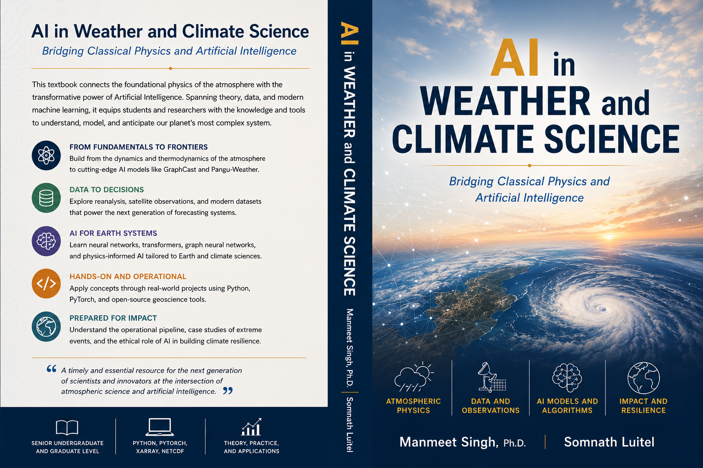

# 🌍 AI in Weather and Climate Science
### *Bridging Numerical Weather Prediction and Deep Learning*

---

### **Authors**
**Asst. Prof. Dr. Manmeet Singh**  
*Western Kentucky University*

**Er. Somnath Luitel**  
*Western Kentucky University*

---

## 📖 About This Project
This repository hosts the development of a comprehensive, high-quality textbook on the application of **Artificial Intelligence** in **Weather and Climate Science**. Designed for both undergraduate and graduate students, this book moves from the fundamental physical engines of the atmosphere to the cutting edge of **Earth System Foundation Models (ESFMs)**.

### 🌟 Key Pedagogical Pillars
- **Computer Science Foundations**: Exhaustive explanations of Neural Networks, Graph Theory, and Attention Mechanisms from first principles.
- **Physical Grounding**: From the Navier-Stokes equations and Thermodynamics to Chaos Theory.
- **Data Mastery**: Deep dives into ERA5 Reanalysis, Satellite Radiances, and NetCDF/Zarr data structures.
- **Architectural Excellence**: Understanding CNNs, LSTMs, Graph Neural Networks (GraphCast), and Transformers (Pangu-Weather).
- **Operational Reality**: Real-world hardware insights, including GPU architectures, OOM sharding, and real-time inference serving.

## 🗂️ Table of Contents
1.  **The Atmospheric Engine**: Dynamics, Thermodynamics, and the Limits of Predictability.
2.  **Numerical Weather Prediction**: The History, Discretization, and The Era of the Grid.
3.  **The Data Landscape**: Observing the Earth from Space to Reanalysis.
4.  **Neural Networks for Meteorologists**: The Computational Neuron and the Theory of Learning.
5.  **Spatial & Temporal Patterns**: CNNs, LSTMs, and Atmospheric Geometry.
6.  **The Transformer Revolution**: Scaled Dot-Product Attention and Foundation Models.
7.  **SOTA Models I**: Graph Theory and Graph Neural Networks (GraphCast).
8.  **SOTA Models II**: Fourier Operators and 3D Transformers.
9.  **Generative AI**: Diffusion Models for Downscaling and Probabilistic Forecasts.
10. **The Operational Pipeline**: Cloud-Native Ingestion and Real-time Inference.
11. **Case Studies**: Hurricanes, Heatwaves, and Atmospheric Rivers.
12. **Physics-Informed AI**: Toward Physical Consistency and Conservation.
13. **The Ethical Horizon**: Democratization, Energy Paradox, and Climate Justice.

---

## 🛠️ Technical Standards
- **Manuscript**: Written in professional, authoritative prose following academic publishing standards.
- **Mathematics**: Fully formalized using LaTeX with step-by-step derivations.
- **Typography**: Optimized for Times New Roman (12pt Justified).
- **Research**: Sourced directly from peer-reviewed journals (Nature, Science, AMS, IEEE).

---

  <i>© 2026 Singh & Luitel. All rights reserved. Western Kentucky University.</i>

