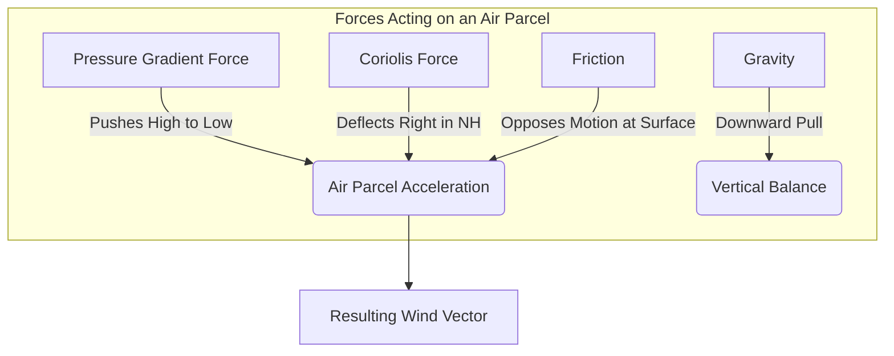

# Chapter 1: The Atmospheric Engine

The Earth’s atmosphere is a thin, dynamic envelope of gases constrained by gravity to a rotating sphere. It is a complex fluid system primarily driven by the uneven distribution of solar radiation. The conversion of this radiative energy into the kinetic energy of atmospheric motion constitutes a vast, planetary-scale heat engine. Understanding the fundamental physical principles that govern this engine is a strict prerequisite for any mathematical or computational modeling of the weather, including the deployment of modern Artificial Intelligence (AI) architectures. The governing principles—thermodynamics, radiative transfer, and fluid dynamics—form a system of non-linear differential equations that describe the conservation of mass, momentum, and energy. These laws define the absolute physical boundaries within which any predictive model must operate (Holton & Hakim, 2012).

## 1.1 Radiative Forcing and the Global Energy Balance

The genesis of all atmospheric motion is the Sun. The Earth intercepts a tiny fraction of the total solar output, yet this interception drives the entirety of the climate system. Because the Earth is nearly spherical, solar radiation (insolation) is not distributed evenly. At the equator, solar rays strike the surface at an angle close to 90 degrees, concentrating the energy over a relatively small surface area and passing through a minimum thickness of the atmosphere. Conversely, at higher latitudes, the curvature of the Earth causes the same amount of solar energy to be spread over a much larger surface area. Furthermore, the rays must traverse a longer path through the atmosphere, leading to increased scattering and absorption by atmospheric gases and aerosols before reaching the surface.

This geometrical reality establishes a profound energy imbalance. To maintain thermal equilibrium over long periods, the Earth system must radiate an amount of energy back to space equal to the solar energy it absorbs. The emission of terrestrial radiation is governed by the Stefan-Boltzmann Law, which dictates that the total energy radiated per unit surface area of a blackbody ($F$) is proportional to the fourth power of its absolute thermodynamic temperature ($T$):

$$F = \sigma T^4 \quad (\text{Eq. 1.1})$$

where $\sigma$ is the Stefan-Boltzmann constant ($\approx 5.67 \times 10^{-8} \, \text{W m}^{-2} \text{K}^{-4}$). While the tropics receive a massive surplus of incoming shortwave solar radiation, they do not emit a proportionally larger amount of longwave terrestrial radiation. The polar regions, inversely, emit more longwave radiation to space than they receive in shortwave insolation. 

*Figure 1.1: The Earth's net radiation budget. A visual representation of the energy surplus at the equator and the deficit at the poles, typically derived from satellite observations such as the CERES instrument.*

If the atmosphere and oceans were static, the tropics would continuously heat up until they boiled, and the poles would cool until they reached absolute zero. The Second Law of Thermodynamics dictates that heat must flow from regions of higher temperature to regions of lower temperature to maximize the entropy of the system. Therefore, the atmosphere and oceans act as a coupled fluid transport system, advecting the surplus heat from the equator toward the poles. This meridional transport of heat is the fundamental mechanism of global weather patterns (Wallace & Hobbs, 2006).

**Table 1.1: Standard Composition of the Dry Atmosphere**
*The relative concentrations of gases significantly impact the absorption of specific radiation bands, dictating the greenhouse effect.*

| Gas | Symbol | Volume Percentage (%) | Radiative Role |
| :--- | :--- | :--- | :--- |
| Nitrogen | $N_2$ | 78.08 | Largely transparent to shortwave/longwave |
| Oxygen | $O_2$ | 20.95 | Transparent; minor absorption in UV |
| Argon | $Ar$ | 0.93 | Inert, no radiative role |
| Carbon Dioxide | $CO_2$ | ~0.04 | Strong absorber of terrestrial longwave |

From an artificial intelligence perspective, understanding this energy balance is critical. When training neural networks to emulate the climate system, the model must inherently account for this continuous forcing. An AI model that fails to transport heat poleward with the correct physical magnitude will inevitably suffer from severe climate drift, producing unphysical temperature extremes during long-term rollout integrations.

## 1.2 The Thermodynamics of Moist Air and Phase Changes

While the dry gases listed in Table 1.1 make up the vast bulk of the atmosphere's mass, it is a trace, highly variable gas—water vapor—that dictates the intensity of extreme weather. Water is unique in the Earth system because it exists naturally in all three phases (solid, liquid, gas) within the typical temperature and pressure ranges of the troposphere. The transitions between these phases involve massive exchanges of energy known as latent heat.

When liquid water evaporates from the ocean surface, it requires energy to overcome the intermolecular hydrogen bonds. This energy is drawn from the surrounding environment, resulting in evaporative cooling. Crucially, the energy is not lost; it is stored as the potential energy of the water vapor molecules. As a parcel of moist air rises in the atmosphere, it expands due to decreasing environmental pressure. This expansion causes the parcel to cool adiabatically (without exchanging heat with its environment). 

The capacity of an air parcel to hold water vapor is strictly governed by its temperature, a relationship formalized by the Clausius-Clapeyron equation:

$$\frac{de_s}{dT} = \frac{L_v e_s}{R_v T^2} \quad (\text{Eq. 1.2})$$

where $e_s$ is the saturation vapor pressure, $T$ is the absolute temperature, $L_v$ is the latent heat of vaporization, and $R_v$ is the gas constant for water vapor. Integrating this equation reveals an exponential relationship: a warmer atmosphere can hold significantly more water vapor. A standard meteorological approximation derived from this equation is that the moisture-holding capacity of the air increases by approximately 7% for every 1°C increase in temperature.

*Figure 1.2: A cumulonimbus incus cloud. The explosive vertical growth is fueled directly by the release of latent heat as water vapor condenses in the mid-troposphere, offsetting adiabatic cooling.*

As the rising air parcel cools to its dew point, the water vapor condenses into liquid cloud droplets. During condensation, the stored latent heat is released into the parcel as sensible heat (kinetic energy). This internal heating partially offsets the adiabatic cooling of expansion. Consequently, a saturated parcel of air cools at a slower rate (the Saturated Adiabatic Lapse Rate, $\Gamma_s \approx 6^\circ\text{C/km}$) than a dry parcel of air (the Dry Adiabatic Lapse Rate, $\Gamma_d \approx 9.8^\circ\text{C/km}$). This difference in cooling rates allows moist air to remain warmer, and therefore more buoyant, than its surrounding environment, driving deep convection and the formation of severe thunderstorms and tropical cyclones.

For data-driven AI models, moisture represents a deeply non-linear threshold mechanism. A model predicting precipitation cannot rely on simple linear extrapolation; it must mathematically represent the exact physical threshold where saturation is reached and latent heat is released. The failure to accurately model this phase transition is a primary reason why traditional statistical methods struggle to forecast intense, localized flooding events.

## 1.3 The Primitive Equations of Motion on a Rotating Sphere

To predict the future state of the atmosphere, meteorologists rely on a set of coupled non-linear partial differential equations known as the primitive equations. These equations are expressions of classical Newtonian mechanics and thermodynamics adapted for a fluid envelope resting on a rotating sphere.

The cornerstone is the conservation of momentum, derived from Newton's Second Law of Motion ($F = ma$). For an infinitesimal parcel of air, the acceleration (the material derivative of velocity, $\mathbf{u}$) is dictated by the sum of the forces acting upon it. In a rotating reference frame, these forces include the pressure gradient force, gravitation, friction, and the apparent forces caused by the Earth's rotation: the Coriolis force and the centrifugal force. The horizontal momentum equations for the zonal ($u$, east-west) and meridional ($v$, north-south) winds are typically expressed as:

$$\frac{Du}{Dt} = -\frac{1}{\rho}\frac{\partial p}{\partial x} + fv + F_x \quad (\text{Eq. 1.3})$$

$$\frac{Dv}{Dt} = -\frac{1}{\rho}\frac{\partial p}{\partial y} - fu + F_y \quad (\text{Eq. 1.4})$$

Here, $\rho$ is the air density, $p$ is the atmospheric pressure, $F_x$ and $F_y$ represent frictional dissipation, and $f$ is the Coriolis parameter, defined as $f = 2\Omega \sin(\phi)$, where $\Omega$ is the Earth's angular velocity and $\phi$ is the latitude. The Coriolis force ($fv$ and $-fu$) does not perform work on the air parcel; it only changes its direction, deflecting motion to the right in the Northern Hemisphere and to the left in the Southern Hemisphere. This deflection is responsible for the rotational nature of large-scale weather systems, balancing the pressure gradient force to create geostrophic flow.

*Figure 1.3: Schematic representation of the primary forces acting on an air parcel in the horizontal plane. Geostrophic balance occurs when the pressure gradient force is exactly opposed by the Coriolis force.*

Alongside momentum, the atmosphere strictly obeys the conservation of mass, expressed mathematically as the continuity equation:

$$\frac{\partial \rho}{\partial t} + \nabla \cdot (\rho \mathbf{u}) = 0 \quad (\text{Eq. 1.5})$$

Equation 1.5 states that the local rate of change of density is entirely determined by the divergence of the mass flux. If air is converging horizontally into a region (e.g., at the center of a surface low-pressure system), the mass must be conserved by forcing the air to rise vertically, leading to cloud formation and precipitation.

The profound mathematical difficulty of the primitive equations lies in the advection terms hidden within the material derivative ($\frac{D}{Dt} = \frac{\partial}{\partial t} + \mathbf{u} \cdot \nabla$). Because the wind field ($\mathbf{u}$) transports the very momentum that determines its future state, the equations are inherently non-linear. They cannot be solved exactly. The entire discipline of Numerical Weather Prediction (NWP), and subsequently AI weather modeling, is devoted to finding stable, accurate approximations of these non-linear dynamics.

## 1.4 Chaos and the Limits of Predictability

If the primitive equations are deterministic, one might naturally assume that forecasting the weather is simply a matter of possessing sufficient computational power. This assumption was shattered in 1963 by the meteorologist Edward Lorenz, who discovered the fundamental property of deterministic chaos within fluid systems.

Lorenz was conducting experiments using a highly simplified mathematical model of atmospheric convection, consisting of three coupled, non-linear ordinary differential equations:

$$\frac{dx}{dt} = \sigma(y - x) \quad (\text{Eq. 1.6})$$
$$\frac{dy}{dt} = x(\rho - z) - y \quad (\text{Eq. 1.7})$$
$$\frac{dz}{dt} = xy - \beta z \quad (\text{Eq. 1.8})$$

In these equations, $\sigma$, $\rho$, and $\beta$ are parameters related to the physical properties of the fluid (the Prandtl number and the Rayleigh number). Lorenz observed that if he restarted a numerical simulation with initial conditions that differed by an infinitesimal amount (e.g., a rounding error in the sixth decimal place), the trajectories of the two simulations would eventually diverge exponentially, leading to entirely unrelated final states (Lorenz, 1963). 

This phenomenon is formally known as Sensitive Dependence on Initial Conditions (SDIC). In the context of atmospheric science, it implies that because we can never measure the current state of the global atmosphere with infinite precision—there will always be microscopic observational errors—our forecasts will inevitably degrade over time. The rate of this divergence is quantified by the leading Lyapunov exponent of the system. For the Earth's troposphere, the theoretical predictability limit for daily weather patterns is generally accepted to be approximately two to three weeks.

*Figure 1.4: The Lorenz Attractor. A phase-space plot of Equations 1.6-1.8. While the exact trajectory is unpredictable over long periods due to chaos, the system is strictly bounded to the geometry of the attractor.*

The discovery of chaos necessitated a fundamental shift in meteorological philosophy: from deterministic prediction to probabilistic forecasting. Rather than issuing a single, highly uncertain forecast, operational centers now generate ensembles—dozens of slightly perturbed simulations run in parallel—to map the probability distribution of future atmospheric states. 

In modern machine learning, modeling this chaotic behavior remains a central challenge. Deterministic AI models trained using standard regression loss functions (like Mean Squared Error) often struggle with chaos. Because they are penalized for predicting an extreme event in the wrong location, they tend to regress to the mean, producing smooth, physically unrealistic forecasts at longer lead times. Overcoming this limitation requires the deployment of advanced probabilistic architectures, such as Generative Diffusion models, which are capable of sampling the complex geometry of the atmospheric attractor rather than simply guessing its average state.

## Bibliography

*   Holton, J. R., & Hakim, G. J. (2012). *An Introduction to Dynamic Meteorology* (5th ed.). Academic Press.
*   Lorenz, E. N. (1963). Deterministic Nonperiodic Flow. *Journal of the Atmospheric Sciences*, 20(2), 130-141.
*   Wallace, J. M., & Hobbs, P. V. (2006). *Atmospheric Science: An Introductory Survey* (2nd ed.). Academic Press.
