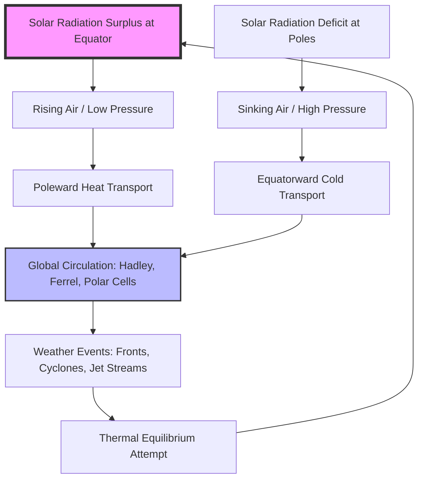

# Chapter 1: The Atmospheric Engine

The atmosphere of the Earth is a complex, rotating fluid system driven by a single primary energy source: the **Sun**. To understand how **Artificial Intelligence (AI)** can forecast weather, we must first understand the physical "engine" that AI is attempting to emulate. This engine is governed by a set of fundamental principles known as the **primitive equations**. These equations describe how mass, momentum, and energy move through the thin layer of gases surrounding our planet. They are not merely mathematical abstractions; they represent the physical constraints that any model, whether based on traditional physics or modern machine learning, must ultimately respect. Without a firm grasp of these laws, the application of machine learning remains a superficial exercise in curve-fitting rather than a pursuit of scientific truth [Holton and Hakim, 2012].

## 1.1 The Primary Driver: Differential Heating and Thermodynamics

The story of weather begins with the geometry of the Earth and the laws of radiative transfer. Because our planet is a sphere, the Sun's radiation does not hit the surface evenly across all latitudes. The equator receives direct, intense solar energy where the photons travel through a shorter path in the atmosphere and strike the ground at a near-perpendicular angle. In contrast, the poles receive slanted, weaker radiation that must pass through a much thicker slice of the atmosphere, losing energy to scattering and absorption along the way. 

### 1.1.1 The Radiative Balance and the Stefan-Boltzmann Law
To understand the magnitude of this energy imbalance, we must look at the **Earth's energy budget**. The incoming solar radiation (shortwave) must be balanced by the outgoing terrestrial radiation (longwave) for the planet to maintain a stable temperature. This balance is governed by the **Stefan-Boltzmann Law**, which states that the total energy radiated per unit surface area of a blackbody is proportional to the fourth power of its absolute temperature:

$$F = \sigma T^4 \quad (\text{Eq. 1.1})$$

In this expression, $F$ is the radiative flux (measured in Watts per square meter), $\sigma$ is the Stefan-Boltzmann constant (approximately $5.67 \times 10^{-8} \, \text{W m}^{-2} \text{K}^{-4}$), and $T$ is the absolute temperature in Kelvin. Because the equator is warmer, it radiates more energy back to space, but not enough to offset the massive surplus of incoming solar heat. Conversely, the poles radiate more energy to space than they receive from the Sun. This creates a permanent **radiative surplus** at the tropics and a **radiative deficit** at the poles.

### 1.1.2 The Atmosphere as a Global Heat Engine
Nature behaves according to the **Second Law of Thermodynamics**, which dictates that entropy in an isolated system must increase, and heat cannot spontaneously move from a cold body to a hot body. To satisfy this law, the atmosphere and the oceans act as a global transport system, essentially a massive **heat engine** that converts thermal energy into kinetic energy. The "work" performed by this engine is the movement of heat from the warm tropics (the heat source) toward the frigid polar regions (the heat sink).

We can estimate the theoretical efficiency ($\eta$) of this atmospheric engine using the **Carnot Cycle** logic. If the tropical surface temperature ($T_H$) is approximately 288 K and the effective emission temperature to space ($T_C$) is approximately 255 K, the maximum theoretical efficiency is:

$$\eta = \frac{T_H - T_C}{T_H} \approx 11\% \quad (\text{Eq. 1.2})$$

In reality, the atmosphere is much less efficient, converting only about 1% of its energy into the kinetic energy of the winds. This is due to frictional dissipation and the irreversible nature of processes like rain and cloud formation. However, even this 1% is responsible for all the storms, hurricanes, and jet streams we observe. For an AI model, the challenge is to learn this "efficiency" from data. The model must understand that a certain amount of thermal gradient will always result in a predictable amount of kinetic motion, a relationship that is fundamentally rooted in these thermodynamic laws.

### 1.1.3 The Meridional Temperature Gradient and Vertical Shear
The consequence of this differential heating is the creation of a **meridional temperature gradient** ($\partial T / \partial y$), where temperature decreases as we move from the equator toward the poles. This gradient is the primary fuel for mid-latitude weather. Through a relationship known as the **Thermal Wind Equation**, we can prove that a horizontal temperature gradient requires the wind speed to increase with height. This is why the **Jet Stream** exists: the sharp temperature contrast between polar and tropical air masses in the mid-latitudes forces the creation of high-speed winds at the top of the troposphere.

*Figure 1.1: The global atmospheric engine. Solar radiation creates a surplus at the equator and a deficit at the poles, forcing the atmosphere to redistribute heat through complex circulation cells and individual weather events.*

## 1.2 The Role of Water and Phase Changes

The circulation is further complicated by the unique properties of water, which exists in all three phases within the narrow temperature range of our atmosphere. When water evaporates from the tropical oceans, it stores a tremendous amount of energy in the form of **latent heat**. This energy is not "felt" as a change in temperature at the surface, but it is carried aloft by rising air currents. Understanding this process requires looking at the molecular level, where phase changes involve the breaking or forming of intermolecular bonds.

### 1.2.1 Molecular Logic of Latent Heat
In the liquid state, water molecules are held together by hydrogen bonds. To evaporate, a molecule must acquire enough kinetic energy to break free from these bonds. This required energy comes from the environment, which is why evaporation is a cooling process. However, during the phase change itself, this energy is stored as **potential energy** of the separated molecules rather than increasing their kinetic energy (temperature). When that vapor later condenses in the cooler upper atmosphere, the molecules reform their bonds, dropping back to a lower potential energy state. The excess energy is then released into the surrounding air as kinetic energy (heat).

This latent heat release acts as a powerful internal battery for the atmosphere. It offsets the adiabatic cooling that occurs as an air parcel rises and expands. This leads us to the concept of the **Saturated Adiabatic Lapse Rate** ($\Gamma_s$), which is approximately 6°C/km in the lower troposphere, significantly smaller than the **Dry Adiabatic Lapse Rate** ($\Gamma_d \approx 9.8$°C/km). This internal source of heat is what allows clouds to become buoyant and grow into massive thunderstorms.

### 1.2.2 The Clausius-Clapeyron Equation
The amount of water vapor the atmosphere can hold is not infinite; it is strictly limited by temperature. This relationship is governed by the **Clausius-Clapeyron Equation**:

$$\frac{de_s}{dT} = \frac{L_v e_s}{R_v T^2} \quad (\text{Eq. 1.3})$$

In this expression, $e_s$ is the saturation vapor pressure, $L_v$ is the latent heat of vaporization, $R_v$ is the gas constant for water vapor, and $T$ is the temperature. The most critical takeaway from Eq. 1.3 is that the capacity of the atmosphere to hold moisture increases **exponentially** with temperature. A well-known rule of thumb derived from this equation is that for every 1°C increase in temperature, the atmosphere can hold approximately 7% more water vapor. 

For the student of AI, this exponential relationship is fundamental. It explains why a warming climate leads to much more intense precipitation events. From a machine learning perspective, moisture represents a classic **"Hidden Variable."** We often have many observations of temperature and pressure, but our observations of moisture are sparse. A neural network must therefore "learn" to infer the latent heat potential of an air mass from these other visible variables to accurately predict storm intensity.

## 1.3 The Governing Equations: A Scientific Map

The motion of the atmosphere is described by a set of coupled partial differential equations that serve as the blueprint for the atmospheric engine. These equations, known collectively as the **primitive equations**, define the boundaries of what is physically possible in the weather system. At the undergraduate level, they are best understood through the lens of five core conservation laws.

### 1.3.1 The Conservation of Momentum
The conservation of momentum is expressed through the **Navier-Stokes equations**, applied to a rotating sphere. For a parcel of air, the change in velocity ($\mathbf{u}$) over time is dictated by the balance of four primary forces:

$$\frac{D\mathbf{u}}{Dt} = -\frac{1}{\rho}\nabla p - 2\mathbf{\Omega} \times \mathbf{u} + \mathbf{g} + \mathbf{F} \quad (\text{Eq. 1.4})$$

The term on the left is the **Material Derivative**, representing the acceleration of an air parcel as it moves. On the right, we have the **Pressure Gradient Force** ($-\frac{1}{\rho}\nabla p$), which pushes air from high to low pressure; the **Coriolis Force** ($-2\mathbf{\Omega} \times \mathbf{u}$), which deflects the wind due to Earth's rotation; the **Effective Gravity** ($\mathbf{g}$), which keeps the atmosphere anchored; and **Friction** ($\mathbf{F}$), which slows the air near the surface. These equations are **non-linear**, meaning the wind itself helps to transport the momentum that changes its own speed, a mathematical complexity that lies at the heart of weather's unpredictability.

### 1.3.2 Conservation of Mass and Energy
Beyond momentum, the atmosphere must satisfy the **Continuity Equation**, which ensures the conservation of mass:

$$\frac{\partial \rho}{\partial t} + \nabla \cdot (\rho \mathbf{u}) = 0 \quad (\text{Eq. 1.5})$$

This equation tells us that if air is converging in one area (moving together), it must lead to an increase in density or, more commonly, move vertically (updrafts). Finally, we have the **First Law of Thermodynamics**, which tracks the conservation of energy:

$$c_p \frac{DT}{Dt} - \frac{1}{\rho} \frac{Dp}{Dt} = Q \quad (\text{Eq. 1.6})$$

This tracks how the temperature ($T$) of an air parcel changes in response to pressure changes (expansion/compression) and external heating ($Q$), such as solar radiation or the latent heat release we discussed in *Section 1.2*. Together with the **Equation of State** (the Ideal Gas Law, $p = \rho RT$), these equations form a closed system. If we know the state of the atmosphere today, these equations theoretically dictate its state tomorrow. The goal of both traditional Numerical Weather Prediction and modern AI is to find the most efficient way to solve this complex, non-linear system.

## 1.4 Chaos and the Limits of Prediction

In the preceding sections, we explored the deterministic laws that govern the atmosphere. If the equations of motion (Eq. 1.4 - 1.6) are exact, one might logically assume that weather prediction is simply a matter of having a large enough computer. However, in 1963, a meteorologist named **Edward Lorenz** discovered a fundamental property of the atmosphere that shattered this hope: **Chaos**. This discovery revealed that even if we have perfect equations, our ability to forecast the future is strictly limited by the nature of the system itself.

### 1.4.1 The Butterfly Effect and Sensitive Dependence
Lorenz's discovery occurred while he was running a simplified computer model of atmospheric convection. He noticed that if he restarted a simulation with initial values that were rounded by an infinitesimal amount (for example, entering **0.506** instead of **0.506127**), the two forecasts would eventually diverge so wildly that they bore no resemblance to each other. This is known as **Sensitive Dependence on Initial Conditions (SDIC)**, or more popularly, the **"Butterfly Effect."**

The "Butterfly Effect" suggests that the flapping of a butterfly's wings in Brazil could, through a chain of non-linear interactions, set off a tornado in Texas weeks later. In mathematical terms, this sensitive dependence is quantified by the **Lyapunov Exponent** ($\lambda$). If $\lambda$ is positive, the distance between two nearly identical starting points will grow exponentially over time. For the Earth's atmosphere, this growth is so rapid that the fundamental limit of day-to-day weather predictability is approximately **two weeks**. No amount of computing power or AI training can "solve" this two-week limit; it is a built-in feature of our planet's physics.

### 1.4.2 The Strange Attractor and the Lorenz Equations
Lorenz demonstrated this behavior using a system of three coupled, non-linear equations that represent a simplified "slice" of the atmosphere:

$$\frac{dx}{dt} = \sigma(y - x) \quad (\text{Eq. 1.7})$$
$$\frac{dy}{dt} = x(\rho - z) - y \quad (\text{Eq. 1.8})$$
$$\frac{dz}{dt} = xy - \beta z \quad (\text{Eq. 1.9})$$

In these equations, $\sigma$ (the **Prandtl number**), $\rho$ (the **Rayleigh number**), and $\beta$ (the **geometric factor**) are parameters that define the state of the fluid. When these equations are plotted in three-dimensional space, they trace a complex, non-repeating, butterfly-shaped fractal known as a **Strange Attractor**. This attractor represents the "possibility space" of the atmosphere. While we cannot predict exactly *where* the system will be on the attractor in three weeks, we know it will always stay *on* the attractor. 

### 1.4.3 From Determinism to Ensembles
Because of chaos, a single "best guess" forecast is inherently flawed. Modern meteorology addresses this through **Ensemble Forecasting**. Instead of running one simulation, we run dozens or hundreds of simulations, each starting with slightly different initial conditions. If the ensemble members stay close together, our confidence is high. If they "spread" wildly across the attractor, we know the atmosphere is in a highly unpredictable state.

This is a critical area for **Artificial Intelligence**. Traditional ensemble methods are extremely expensive because they require solving the primitive equations hundreds of times. Modern AI architectures, particularly **Generative Models**, are exceptionally good at sampling from these complex distributions. An AI model can "learn" the shape of the atmospheric attractor from 40 years of historical data and generate thousands of ensemble members in seconds. This allows us to move from predicting "The Weather" to predicting the **probability** of weather, providing a more honest and useful tool for global decision-making.

## Bibliography for Chapter 1

*   **Charney, J. G., Fjørtoft, R., and von Neumann, J. (1950).** *Numerical Integration of the Barotropic Vorticity Equation*. Tellus.
*   **Holton, J. R., and Hakim, G. J. (2012).** *An Introduction to Dynamic Meteorology*. Academic Press.
*   **Kashinath, K., et al. (2021).** *Physics-informed machine learning: case studies for weather and climate*. Philosophical Transactions of the Royal Society A.
*   **Lorenz, E. N. (1963).** *Deterministic Nonperiodic Flow*. Journal of the Atmospheric Sciences.
*   **Lorenz, E. N. (1969).** *The predictability of a flow which possesses many scales of motion*. Tellus.
*   **Wallace, J. M., and Hobbs, P. V. (2006).** *Atmospheric Science: An Introductory Survey*. Academic Press.
