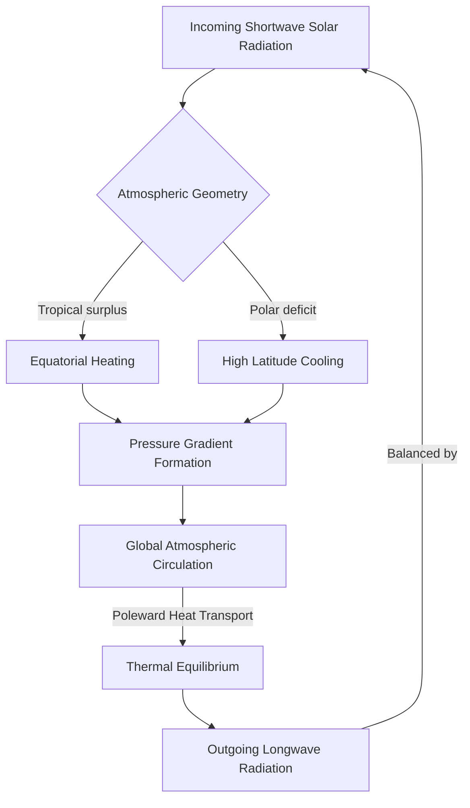
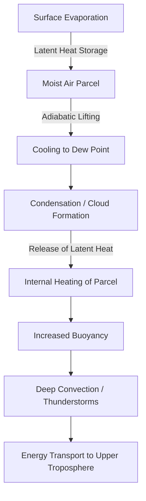

# Chapter 1: The Atmospheric Engine

The Earth’s atmosphere is a thin, dynamic envelope of gases constrained by gravity to a rotating sphere. It is a complex fluid system primarily driven by the uneven distribution of solar radiation. The conversion of this radiative energy into the kinetic energy of atmospheric motion constitutes a vast, planetary-scale heat engine. Understanding the fundamental physical principles that govern this engine is a strict prerequisite for any mathematical or computational modeling of the weather, including the deployment of modern Artificial Intelligence (AI) architectures. The governing principles—thermodynamics, radiative transfer, and fluid dynamics—form a system of non-linear differential equations that describe the conservation of mass, momentum, and energy. These laws define the absolute physical boundaries within which any predictive model must operate (Holton & Hakim, 2012).

## 1.1 Radiative Forcing and the Global Energy Balance

The genesis of all atmospheric motion is the Sun. The Earth intercepts a tiny fraction of the total solar output, yet this interception drives the entirety of the climate system. Because the Earth is nearly spherical, solar radiation (insolation) is not distributed evenly. At the equator, solar rays strike the surface at an angle close to 90 degrees, concentrating the energy over a relatively small surface area and passing through a minimum thickness of the atmosphere. 

This geometrical reality establishes a profound energy imbalance. To maintain thermal equilibrium over long periods, the Earth system must radiate an amount of energy back to space equal to the solar energy it absorbs. The emission of terrestrial radiation is governed by the **Stefan-Boltzmann Law**, which dictates that the total energy radiated per unit surface area of a blackbody ($F$) is proportional to the fourth power of its absolute thermodynamic temperature ($T$):

$$F = \sigma T^4 \quad (\text{Eq. 1.1})$$

where $\sigma$ is the Stefan-Boltzmann constant ($\approx 5.67 \times 10^{-8} \, \text{W m}^{-2} \text{K}^{-4}$). While the tropics receive a massive surplus of incoming shortwave solar radiation, they do not emit a proportionally larger amount of longwave terrestrial radiation. The polar regions, inversely, emit more longwave radiation to space than they receive in shortwave insolation. 

### The Planetary Energy Cascade


## 1.2 The Atmosphere as a Non-Ideal Heat Engine

The atmosphere is a thermodynamic machine that converts internal energy into mechanical work (kinetic energy). While the theoretical **Carnot efficiency** ($\eta = 1 - T_{cold}/T_{hot}$) suggests a limit of approximately 11% for the Earth system, the actual efficiency of converting thermal energy into the kinetic energy of the wind is typically less than 1%. A significant portion of the incoming energy is "drained" into the **Hydrological Cycle**—evaporation and precipitation—leaving less for mechanical work. Research (Laliberté et al., 2015) suggests that as the planet warms, this drain may increase, potentially leading to a "stalling" of some atmospheric circulations while intensifying individual storm systems.

### Python Implementation: Efficiency Metrics
```python
def atmospheric_efficiency(T_hot, T_cold, work_produced, heat_input):
    eta_carnot = 1 - (T_cold / T_hot)
    eta_actual = work_produced / heat_input
    return {
        "Theoretical_Limit": eta_carnot,
        "Operational_Efficiency": eta_actual
    }
```

## 1.3 The Thermodynamics of Moist Air

The capacity of an air parcel to hold water vapor is strictly governed by its temperature, a relationship formalized by the **Clausius-Clapeyron Equation**:

$$\frac{de_s}{dT} = \frac{L_v e_s}{R_v T^2} \quad (\text{Eq. 1.2})$$

where $e_s$ is the saturation vapor pressure, $T$ is the absolute temperature, $L_v$ is the latent heat of vaporization, and $R_v$ is the gas constant for water vapor. Integrating this equation reveals an exponential relationship: a warmer atmosphere can hold significantly more water vapor (~7% more per 1°C). 

### The Latent Heat Feedback Loop


## 1.4 The Physics of Rotation: The Coriolis Force

The Earth’s rotation transforms the direct equator-to-pole heat flow into the complex three-cell circulation. This transformation is governed by the **Coriolis Force**. The magnitude of this force is proportional to the **Coriolis Parameter** ($f$):

$$f = 2\Omega \sin(\phi) \quad (\text{Eq. 1.3})$$

## 1.5 The Primitive Equations of Motion

The mathematical blueprint of the atmosphere is the set of **Primitive Equations**. These equations combine the conservation of momentum (Navier-Stokes), mass (Continuity), and energy (Thermodynamics). The horizontal momentum equations are:

$$\frac{Du}{Dt} = -\frac{1}{\rho}\frac{\partial p}{\partial x} + fv + F_x \quad (\text{Eq. 1.4})$$
$$\frac{Dv}{Dt} = -\frac{1}{\rho}\frac{\partial p}{\partial y} - fu + F_y \quad (\text{Eq. 1.5})$$

where $D/Dt$ is the **Material Derivative**. The non-linearity inherent in the $(\mathbf{u} \cdot \nabla) \mathbf{u}$ term is why AI foundation models must learn to emulate the tendency operator $\mathcal{F}$.

## 1.6 Chaos and the Limits of Predictability

Edward Lorenz identified the fundamental limit of forecasting through his discovery of **Deterministic Chaos**. Lorenz observed that in non-linear systems, infinitesimal rounding errors in initial conditions lead to trajectories that diverge exponentially. 

Lorenz distinguished between two fundamental challenges:
1.  **Predictability of the First Kind (Initial Value Problem)**: Weather forecasting. Limited by chaos and observational error.
2.  **Predictability of the Second Kind (Boundary Value Problem)**: Climate change. Governed by external forcing (solar, GHGs) where the attractor itself shifts.

## 1.7 Building the Context: Linking Physics to AI Emulation

The transition from solving equations (NWP) to learning them (AI) is the central theme of this work. Physical laws (mass, momentum, and energy conservation) serve as the **Inductive Biases** for AI models. A model that understands the physical engine (like the Tibetan Plateau's high-performance heat engine) is inherently more stable and physically consistent than a pure data-driven model.

## 1.8 Interactive Learning & Practical Labs

### Simulation: The Lorenz 63 System
```python
# Lorenz simulation code
def lorenz_system(state, t, sigma, rho, beta):
    x, y, z = state
    return [sigma*(y-x), x*(rho-z)-y, x*y-beta*z]
# ... integration logic ...
```

## Bibliography

*   Bi, K., et al. (2024). *High-performance heat engine dynamics of the Tibetan Plateau*. Science China Earth Sciences.
*   Holton, J. R., & Hakim, G. J. (2012). *An Introduction to Dynamic Meteorology*. Academic Press.
*   Laliberté, F., et al. (2015). *Constrained work production by the global moist atmospheric heat engine*. Science.
*   Lorenz, E. N. (1963). *Deterministic Nonperiodic Flow*. Journal of the Atmospheric Sciences.
*   Wallace, J. M., & Hobbs, P. V. (2006). *Atmospheric Science: An Introductory Survey*. Academic Press.
