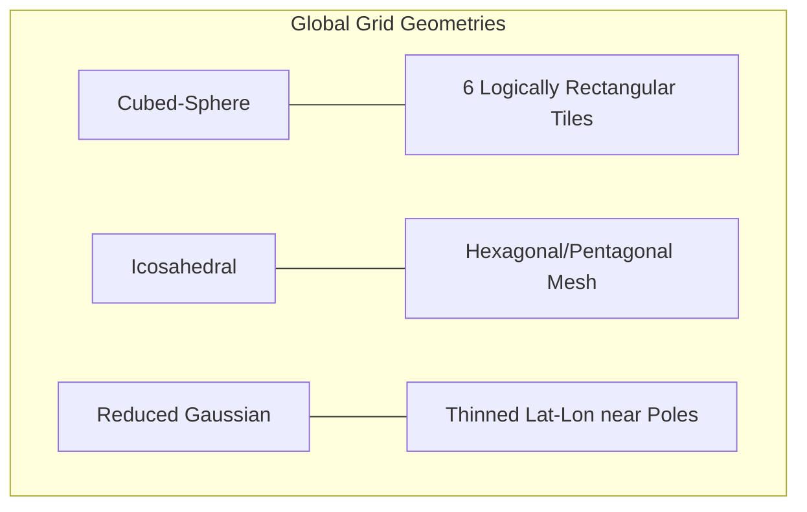
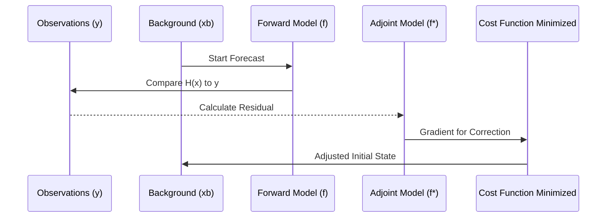

# Chapter 2: Numerical Weather Prediction (NWP): The Era of the Grid

Numerical Weather Prediction (NWP) represents one of the most successful applications of mathematics and physics in human history. It is the process of translating the fundamental laws of fluid dynamics into a language that computers can solve, allowing us to simulate the future state of the global atmosphere. To understand why **Artificial Intelligence (AI)** is now poised to revolutionize this field, one must first appreciate the staggering intellectual and technical effort that built the current paradigm. This chapter explores the journey from manual hand-calculations to massive supercomputing grids, detailing the mathematical frameworks of discretization, the geographical challenges of modeling a sphere, and the computational bottlenecks that have necessitated the shift toward machine learning.

## 2.1 The Visionaries: From Richardson's Dream to the ENIAC Reality

The history of NWP is a story of human ambition outstripping technological capacity. The conceptual seed was planted in 1922 by the British scientist **Lewis Fry Richardson**, who published his seminal work *Weather Prediction by Numerical Process*. Richardson proposed that the future state of the atmosphere could be calculated by solving a set of finite-difference equations on a global grid. He famously envisioned a **"Forecast Factory"**—a vast, circular auditorium filled with 64,000 human "computers" (calculators). In this vision, a conductor in the center would use a beam of light to synchronize the work, as each calculator solved the equations for a small patch of the atmosphere and passed the results to their neighbors. 

Richardson attempted a manual six-hour forecast for a single point, but the result was a predicted pressure change of 145 hPa—a physically impossible surge that would have shattered windows and collapsed buildings. This failure, while discouraging, provided the first major lesson of NWP: real-world observations contain "noise" in the form of high-frequency gravity waves. Because Richardson did not "smooth" or "filter" his initial data, the equations interpreted this noise as massive physical signals. This realization established the necessity of **initialization** and **data assimilation**, techniques we use to this day to ensure our models start from a physically balanced state [Lynch, 2006].

The dream of NWP was realized thirty years later at the **Aberdeen Proving Ground** in Maryland. In March 1950, a team led by **Jule Charney**, **Ragnar Fjørtoft**, and **John von Neumann** performed the first successful computer forecast on the **ENIAC** (Electronic Numerical Integrator and Computer). Because the ENIAC had a mere 20 registers of high-speed memory, the team could not solve the full primitive equations. Instead, they utilized the **Barotropic Vorticity Equation**, a simplified 2D model that treats the atmosphere as a single layer at the 500-millibar level:

$$\frac{\partial \zeta}{\partial t} + \mathbf{v} \cdot \nabla (\zeta + f) = 0 \quad (\text{Eq. 2.1})$$

In this expression, $\zeta$ is the relative vorticity (local spin), $f$ is the Coriolis parameter (planetary spin), and their sum $\zeta + f$ is the **absolute vorticity**. Eq. 2.1 states that absolute vorticity is conserved for a fluid parcel. This simple "conservation of spin" principle allowed the team to capture the movement of large-scale Rossby waves, proving that the atmosphere's complexity was mathematically tractable. Remarkably, it took the ENIAC 24 hours of continuous operation to produce a 24-hour forecast, requiring the manual handling of roughly 100,000 punch cards [Charney et al., 1950].

## 2.2 The Philosophy of Discretization: Breaking the Continuum

To move the atmosphere from the physical world to the digital world, we must confront a fundamental philosophical hurdle: the atmosphere is a **continuum**, but computers are **discrete** machines. In the real world, properties like temperature and wind vary smoothly and continuously. However, a computer can only store a finite number of values. We must therefore "break" the continuous atmosphere into a finite number of pieces, a process known as **discretization**. 

Think of discretization as the transition from an oil painting to a digital photograph. In an oil painting, the colors blend seamlessly at any magnification. In a digital photograph, if you zoom in far enough, you eventually encounter the individual **pixels**. In NWP, these pixels are our **grid cells**. Every physical process—the rising of a warm air parcel, the friction of wind against a forest, the formation of a cloud droplet—must be represented within these discrete blocks. 

```mermaid
graph LR
    subgraph "Finite Difference (Point-based)"
    A[Point i-1] --- B[Point i] --- C[Point i+1]
    B -.->|Derivative| D[Slope at B]
    end
    subgraph "Finite Volume (Cell-based)"
    E[Cell i-1] |Flux| F[Cell i] |Flux| G[Cell i+1]
    F -.->|Integral| H[Average in F]
    end
```
*Figure 2.1: Comparison of discretization philosophies. Finite Difference (left) treats the atmosphere as a set of discrete values at specific points, calculating changes via the slope between them. Finite Volume (right) treats the atmosphere as a series of connected boxes, calculating changes by tracking the physical "flux" (flow) of mass and energy across the cell boundaries, ensuring inherent conservation of the system.*

There are three primary mathematical ways to achieve this:
1.  **Finite Difference (FD)**: Replaces derivatives with differences between values at discrete points. This is the most intuitive method and forms the basis of many early models.
2.  **Finite Volume (FV)**: Treats variables as averages over a volume rather than values at a point. This method is highly favored in modern models (like NOAA's **FV3**) because it inherently satisfies **Conservation Laws**—ensuring that the total mass or energy in the model does not "leak" away over time.
3.  **Finite Element (FE)**: Represents the solution as a sum of local functions within "elements." While mathematically complex, FE methods (and their variant, **Spectral Elements**) are exceptionally good at scaling on modern GPU-based supercomputers [Kashinath et al., 2021].

## 2.3 Horizontal Discretization: The Geography of the Sphere

Once we decide to discretize, we must choose a geometry to cover the Earth. For decades, the standard choice was the **Latitude-Longitude Grid**. While simple to program, this grid suffers from the **"Pole Problem."** Because lines of longitude converge at the poles, the grid cells become extremely narrow as they approach the top and bottom of the globe. 


*Figure 2.2: Modern solutions to the Pole Problem. (A) The Cubed-Sphere inflates a cube to cover the Earth, using six rectangular tiles to avoid polar convergence. (B) The Icosahedral grid uses a soccer-ball-like mesh of hexagons for extreme uniformity. (C) The Reduced Gaussian grid maintains latitude-longitude lines but removes points as they approach the poles to keep grid cell sizes consistent.*

This creates a severe computational bottleneck governed by the **CFL (Courant-Friedrichs-Lewy) Condition**. The CFL condition dictates that the time step ($\Delta t$) of a model must be small enough that information does not travel across an entire grid cell in a single "tick" of the model clock. Because the cells at the poles are so tiny, the entire global model is forced to use an impractically small time step, requiring millions of redundant calculations. To solve this, modern centers use specialized geometries:
-   **Reduced Gaussian Grids**: Used by the **ECMWF**, these grids decrease the number of longitude points as they approach the poles, keeping the physical size of the cells quasi-uniform.
-   **Cubed-Sphere Grids**: Project the six faces of a cube onto the Earth, avoiding the poles entirely but creating "singularities" at the eight corners of the cube.
-   **Icosahedral Grids**: Based on a 20-sided polygon (hexagons and pentagons), these grids (used in models like **MPAS** and **ICON**) provide the most uniform coverage of the sphere, reducing "grid imprinting" and allowing for variable-resolution "stretching" over areas of interest.

## 2.4 Vertical Discretization: Hydrostatic vs. Non-Hydrostatic

In the vertical dimension, atmospheric modeling is defined by the **Hydrostatic Assumption**. This principle states that the vertical pressure gradient force is exactly balanced by the force of gravity:

$$\frac{\partial p}{\partial z} = -\rho g \quad (\text{Eq. 2.2})$$

For large-scale weather systems (thousands of kilometers wide), the atmosphere is like a very thin sheet of paper where vertical motions are negligible compared to horizontal ones. Hydrostatic models leverage this simplification to run much faster, filtering out vertical sound waves that would otherwise require tiny time steps.

However, as we push model resolutions below **5 kilometers**, the hydrostatic assumption fails. At these "convection-permitting" scales, the vertical accelerations within a thunderstorm or over a mountain ridge are powerful enough to defy Eq. 2.2. Modern **Non-Hydrostatic** models must solve the full vertical momentum equation, adding significant mathematical complexity. For the AI researcher, this is a critical frontier: machine learning models can be trained on non-hydrostatic datasets to "learn" these vertical dynamics without the heavy computational penalty of solving the full equations in real-time.

## 2.5 Spectral Methods: The "Music" of the Atmosphere

An elegant alternative to grid-based modeling is the **Spectral Method**. Instead of using points, spectral models represent atmospheric fields as a sum of smooth, oscillating waves called **Spherical Harmonics**. Think of the Earth as a giant bell; spherical harmonics are the "musical notes" or overtones that describe its vibration. The lowest-order harmonics represent global patterns (like the cold polar air and warm tropical air), while higher-order harmonics represent smaller features like storms.

The primary advantage of spectral methods is their "infinite" horizontal accuracy—there are no gaps between points because the waves cover the entire sphere. However, they face a severe scaling bottleneck known as the **Legendre Transform**. As we increase the resolution (the number of "notes"), the computational cost of this transform increases as **$O(N^3)$**. This "cubic scaling" means that doubling the resolution requires an **eightfold increase** in the time it takes to perform the mathematical transforms. This is the primary **"Resolution Wall"** for global models, forcing centers to explore new architectures that can break through this cubic penalty.

## 2.6 Data Assimilation: The Bridge to Reality

A weather model is only as good as its starting point. **Data Assimilation (DA)** is the mathematical process of combining a previous forecast with billions of new observations (satellites, balloons, stations) to create an "analysis." This is achieved by minimizing a **Cost Function ($J$)**:

$$J(x) = \frac{1}{2}(x - x_b)^T B^{-1} (x - x_b) + \frac{1}{2}(y - H(x))^T R^{-1} (y - H(x)) \quad (\text{Eq. 2.3})$$

Eq. 2.3 is essentially a **"penalty score."** The first term penalizes the model if it drifts too far from the **background** ($x_b$) physics. The second term penalizes it if it ignores what the observations ($y$) are actually seeing. The term $H(x)$ is the **Observation Operator**, which translates model variables into observable quantities like satellite radiances. 


*Figure 2.3: The 4D-Var cycle. The process uses the "Adjoint Model" to propagate information from future observations backward in time to adjust the initial starting state, ensuring the forecast trajectory is physically consistent with all available data.*

Modern centers use **4D-Var**, which fits a trajectory over a 6-12 hour window, or the **Ensemble Kalman Filter (EnKF)**, which uses a swarm of models to estimate the uncertainty. Interestingly, the logic of minimizing Eq. 2.3 is almost identical to the **Gradient Descent** used to train AI models. This shared mathematical heritage is why AI is so effective at speeding up the "DA loop," which currently consumes half of the supercomputing power at major weather centers.

## 2.7 The Path Forward: Confronting the Triple Wall of NWP

As we stand at the threshold of a new era in atmospheric science, we must confront a series of formidable barriers that traditional Numerical Weather Prediction is beginning to encounter. These are not merely technical inconveniences; they represent deep structural limitations in how we have approached weather forecasting for the last seventy years. We can conceptualize these barriers as a "Triple Wall" consisting of computational complexity, technical maintenance, and environmental sustainability.

The first barrier is the **Computational Complexity Wall**. As we have explored with spectral models, the cost of increasing resolution is not linear. When we strive for the "holy grail" of global kilometer-scale modeling—where we can explicitly resolve individual thunderstorms everywhere on Earth—the mathematical transforms required by spectral methods explode in cost. This cubic scaling means that the supercomputers of tomorrow would need to be orders of magnitude larger and faster just to maintain current forecasting schedules at higher resolutions. We are reaching a point where the traditional mathematical "tricks" that served us well at fifty-kilometer resolution are becoming our greatest liabilities at the one-kilometer scale.

The second barrier is the **Adjoint Bottleneck**, a human and technical crisis that is often overlooked in the broader scientific community. To perform the sophisticated 4D-Var data assimilation that makes modern forecasts so accurate, we must maintain an "Adjoint" of the entire forecast model. This is essentially a massive, parallel codebase that calculates the model's trajectory backward in time. Every time a scientist improves the physics of the main model, the adjoint must be meticulously updated by hand. This has created a "maintenance debt" that is stifling innovation. Researchers are often hesitant to experiment with new physical ideas simply because the human cost of updating the adjoint is too high. This is where the "differentiable" nature of modern AI provides a revolutionary escape: machine learning models are "born" with their own adjoints through the process of automatic differentiation, removing this human bottleneck entirely.

Finally, we must address the **Energy Wall**. There is a profound climate irony in our current approach to weather science: to predict the impact of global warming, we are building supercomputers that consume enough electricity to power small cities. The carbon footprint of a single global 4D-Var cycle is significant. As we move toward a future of global climate resilience, our methods of prediction must become as sustainable as the solutions we seek. AI models, which can perform a global forecast in seconds on a fraction of the hardware, offer a path toward a sustainable forecasting future. 

In this light, the rise of Artificial Intelligence is not a rejection of the century of progress in NWP. Rather, it is the logical next step in our quest to understand the atmosphere. NWP has provided us with the "grammar" of the Earth—a consistent, physical language recorded in petabytes of historical data. In the following chapters, we will explore how AI is learning this language, turning the hard-earned wisdom of traditional physics into a new, lightning-fast era of prediction.

## Bibliography for Chapter 2

*   **Bannister, R. N. (2017).** *A review of operational methods of variational and ensemble-variational data assimilation*. Quarterly Journal of the Royal Meteorological Society.
*   **Charney, J. G., Fjørtoft, R., and von Neumann, J. (1950).** *Numerical Integration of the Barotropic Vorticity Equation*. Tellus.
*   **Holton, J. R., and Hakim, G. J. (2012).** *An Introduction to Dynamic Meteorology*. Academic Press.
*   **Lynch, P. (2006).** *The Emergence of Numerical Weather Prediction: Richardson's Dream*. Cambridge University Press.
*   **Richardson, L. L. (1922).** *Weather Prediction by Numerical Process*. Cambridge University Press.
*   **Wallace, J. M., and Hobbs, P. V. (2006).** *Atmospheric Science: An Introductory Survey*. Academic Press.
