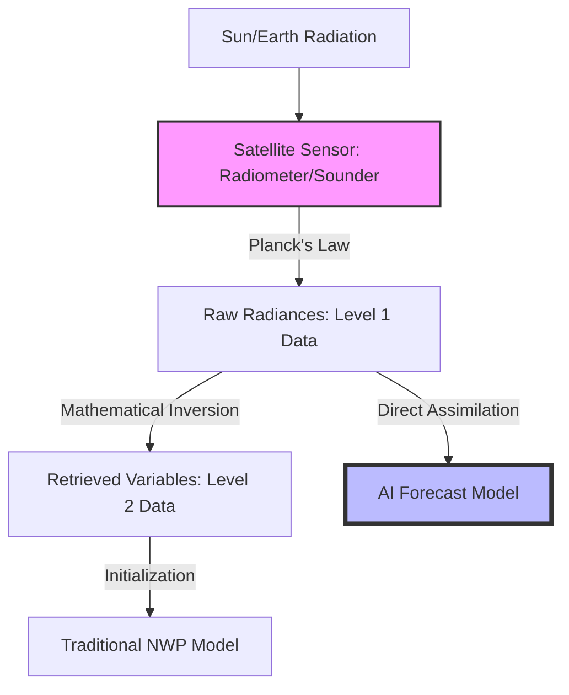
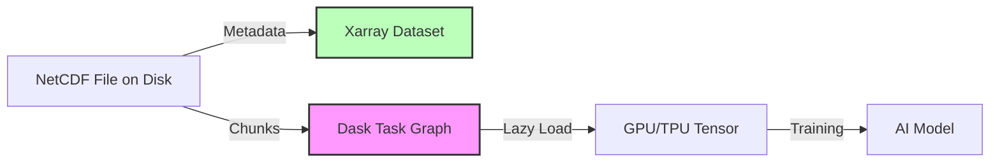

# Chapter 3: The Data Landscape: From Satellites to Reanalysis

The digital revolution in atmospheric science is built upon a foundation of light and mathematics. Before a single neural network can be trained to predict a hurricane's path, the chaotic, continuous state of the atmosphere must be converted into a structured, digital format. This transformation begins hundreds of kilometers above the Earth's surface, where specialized sensors capture the electromagnetic signature of the planet. This chapter explores the journey of weather data: from the raw **radiances** measured by satellites to the "mathematically perfect" historical records known as **reanalysis**, and finally into the high-dimensional **tensors** that serve as the primary fuel for Artificial Intelligence. Understanding this data landscape is not merely a technical prerequisite; it is a fundamental requirement for any researcher seeking to bridge the gap between physical reality and machine learning.

## 3.1 Observing the Earth: The Physics of Satellites

The primary challenge of meteorology has always been the sheer scale of the planet. For most of human history, our data consisted of sparse, point-based observations from surface stations and ships. This left vast data deserts over the oceans and polar regions, where storms could brew undetected for days. The launch of the first weather satellites in the 1960s changed this forever, providing the first truly global view of the atmospheric engine. However, satellites do not measure temperature or wind in the way a thermometer or anemometer does. Instead, they measure the energy emitted and reflected by the Earth and its atmosphere across various wavelengths of the electromagnetic spectrum. 

### 3.1.1 Planck's Law and the Source of Signal
The physics of satellite remote sensing is rooted in the **Planck Function**, which describes the spectral density of electromagnetic radiation emitted by a blackbody in thermal equilibrium. For a given wavelength ($\lambda$) and absolute temperature ($T$), the spectral radiance ($B_\lambda$) is given by:

$$B_\lambda(T) = \frac{2hc^2}{\lambda^5} \frac{1}{e^{\frac{hc}{\lambda k_B T}} - 1} \quad (\text{Eq. 3.1})$$

In this expression, $h$ is Planck's constant ($6.626 \times 10^{-34} \, \text{J s}$), $c$ is the speed of light, and $k_B$ is the Boltzmann constant. Satellite sensors, such as the **Advanced Baseline Imager (ABI)** or the modern **Infrared Sounder (IRS)** launched in 2025, are designed to capture these radiances in specific windows of the spectrum. For example, in the thermal infrared window (around 10.3 micrometers), the atmosphere is relatively transparent, allowing the satellite to "see" the temperature of the Earth's surface or the tops of clouds. By applying Eq. 3.1 in reverse, scientists can calculate the **brightness temperature** of the target, providing a proxy for the actual physical temperature.

### 3.1.2 Radiances vs. Retrievals: The Inversion Problem
The raw data recorded by a satellite is known as **Level 1** data, which consists of geolocated and calibrated radiances. To make this data useful for traditional weather models, it must often undergo a process called **retrieval**. Retrieval is a mathematical inversion where the observed radiances are used to estimate physical properties like water vapor concentration or temperature profiles. This is an "ill-posed" problem because many different atmospheric states could theoretically produce the same set of observed radiances. To solve this, scientists use prior information from previous forecasts to narrow down the possibilities, resulting in **Level 2** products.

For the modern AI researcher, the choice between using raw radiances or retrieved variables is critical. While retrieved variables (Level 2) are easier to interpret, they are "pre-digested" by a physical model, which can bake in existing model biases. Recent breakthroughs in **Direct Radiance Assimilation** have shown that training deep neural networks directly on raw Level 1 radiances allows the AI to discover subtle non-linear physical correlations that human-designed retrieval algorithms might miss. This "end-to-end" learning approach is a cornerstone of the next generation of weather AI.

*Figure 3.1: The satellite data flow. Energy is captured by sensors and converted to radiances. Traditionally, these are inverted into physical variables, but modern AI models increasingly ingest the raw radiances directly to avoid retrieval errors.*

## 3.2 The Reanalysis Revolution: ERA5

While satellites provide a snapshot of the atmosphere today, climate science requires a consistent, multi-decadal record of the past. Unfortunately, the historical record is a messy patchwork of changing technologies. If we simply looked at the raw observations over the last 50 years, we might see "trends" that are actually just changes in how we measured the data. To solve this, meteorologists created **reanalysis**. Reanalysis takes a fixed, state-of-the-art version of a weather model and re-runs it for the past several decades, ingesting all available historical observations through a consistent data assimilation framework.

### 3.2.1 The Logic of 4D-Var Reanalysis
The current gold standard for reanalysis is **ERA5**, produced by the **ECMWF**. ERA5 uses **4D-Var (Four-Dimensional Variational)** data assimilation within a 12-hour window. This process iteratively adjusts the initial state of the model to minimize a **Cost Function ($J$)**, ensuring the final grid is not just a statistical average of observations, but a physically consistent "movie" that obeys the laws of fluid dynamics:

$$J(x) = J_b(x) + J_o(x) \quad (\text{Eq. 3.2})$$

By solving Eq. 3.2 retrospectively for every hour since 1940, ERA5 provides a **mathematically complete grid** of the atmosphere. Even in regions where no observations were ever taken (e.g., the center of the Southern Ocean in 1960), the model fills in the gaps based on the physics of how air must have moved from the nearest available data. This provides a global, 4-dimensional view of the atmosphere at a horizontal resolution of **31 kilometers** with 137 vertical levels.

### 3.2.2 ERA5 as the AI Ground Truth
For the AI community, reanalysis is the "miracle dataset." It provides a high-fidelity, consistent ground truth that is large enough to train massive deep learning models. Most breakthrough models, such as **GraphCast**, **FourCastNet**, and **Pangu-Weather**, were trained almost exclusively on ERA5. The AI learns the "grammar" of the atmosphere by observing how these physically consistent states evolve over time. However, a critical caveat remains: reanalysis is still a model-based product. If the underlying model in ERA5 has a systematic bias, the AI will learn that bias as "truth." This makes understanding the reanalysis process essential for interpreting AI forecast errors.

## 3.3 The Language of Tensors: NetCDF and Xarray

Once the atmospheric state is captured or reconstructed, it must be stored in a way that AI models can ingest. In meteorology, weather information is unique because of its high dimensionality. To describe a single moment in the atmosphere, we need the value of variables at every latitude, longitude, and vertical level. When we add the dimension of time, we arrive at a 4-dimensional structure known in machine learning as a **tensor**.

### 3.3.1 NetCDF and Self-Describing Metadata
To store these massive 4D arrays, the community developed the **NetCDF (Network Common Data Form)**. Developed by NASA and Unidata in the 1980s, NetCDF is more than a file format; it is a **self-describing** system. A NetCDF file stores both the raw numerical values and the **metadata** required to interpret them—such as the units (e.g., Kelvin), the coordinate names (e.g., `lat`, `lon`), and the time projection. This ensures that a dataset created in 1990 remains perfectly readable by a Python script in 2026.

We can represent a single weather tensor ($T$) mathematically as:
$$T_{i,j,k,l} = f(time_i, level_j, lat_k, lon_l) \quad (\text{Eq. 3.3})$$

### 3.3.2 Xarray and Dask: Managing the "Memory Wall"
While NetCDF is the storage format, **Xarray** is the primary software bridge used by AI researchers to manipulate these tensors. Xarray allows scientists to use labeled dimensions, writing code like `data.sel(time='2026-05-20')` instead of memorizing integer indices. However, as datasets push into the petabyte scale, they often exceed the RAM of even the largest workstations. 

To solve this, Xarray integrates with **Dask**, a library for parallel computing. Dask uses **Lazy Evaluation**: it does not load the data into memory until an operation is explicitly requested. Instead, it creates a **Task Graph**, breaking the massive global tensor into smaller, manageable **chunks** (typically 100-200 MB). This allows a researcher to process the entire ERA5 dataset—terabytes of data—on a machine with only 16GB of RAM. Mastering this "chunking" logic is the first step in moving from a classroom exercise to a real-world AI operational project.

*Figure 3.2: The Xarray-Dask bridge. Data is not loaded all at once; it is "chunked" and managed via a task graph, allowing massive atmospheric tensors to be streamed into AI models without exhausting system memory.*

## 3.4 The Throughput Barrier: The New Bottleneck

As we move toward the era of **Earth System Foundation Models (ESFMs)**, the field is hitting a final, formidable wall: **Throughput**. In 2026 research, the primary limit of AI meteorology is not the speed of the GPU, but the speed of the "pipe" connecting the data to the GPU. This is known as the **I/O (Input/Output) Bottleneck**.

Moving a single 10-day global forecast at 0.1-degree resolution involves hundreds of gigabytes of data. When training a model over 40 years of ERA5 data, the time spent simply "reading from disk" can exceed the time spent "calculating gradients" by a factor of ten. This reality is forcing a radical shift in architecture. Future models will likely utilize **In-Situ AI**, where machine learning components are embedded directly within the data storage layer or the climate model itself, compressing and summarizing the atmosphere's state before it ever travels across the network. The "Data Landscape" is no longer just a collection of files; it is a high-speed, high-dimensional highway that defines the speed of scientific discovery.

## Bibliography for Chapter 3

*   **Hersbach, H., et al. (2020).** *The ERA5 global reanalysis*. Quarterly Journal of the Royal Meteorological Society.
*   **Hortal, M., and Simmons, A. J. (1991).** *Use of reduced Gaussian grids in spectral models*. Monthly Weather Review.
*   **Hoyer, S., and Hamman, J. (2017).** *xarray: N-D labeled arrays and datasets in Python*. Journal of Open Research Software.
*   **Kidder, S. Q., and Vonder Haar, T. H. (1995).** *Satellite Meteorology: An Introduction*. Academic Press.
*   **Rew, R., and Davis, G. (1990).** *NetCDF: An Interface for Scientific Data Access*. IEEE Computer Graphics and Applications.
*   **Unidata. (2023).** *Network Common Data Form (NetCDF)*. [Online]. Available: https://www.unidata.ucar.edu/software/netcdf/.
