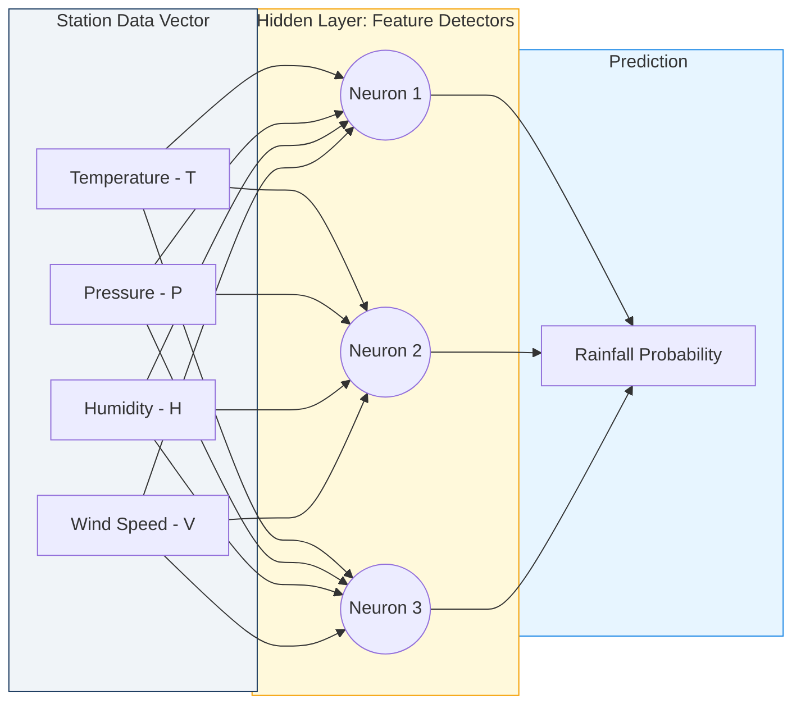

# Chapter 4: Beyond Linear Regression: Neural Networks for Meteorologists

The transition from classical statistical techniques to modern machine learning represents a paradigm shift in how we process atmospheric data. While traditional methods like linear regression served as the backbone of objective weather forecasting for decades, they are fundamentally constrained by their inability to represent the complex, non-linear interactions that define our fluid planet. In this chapter, we explore the evolution of these ideas, beginning with the history of statistical post-processing and culminating in the architecture of the **Artificial Neural Network**. We will see that these networks are not merely "black boxes" but are mathematical structures capable of approximating the very physics that govern the winds and the rain.

## 4.1 The Limits of Statistical Forecasting: History and Chaos

The origin of objective weather forecasting can be traced back to the development of **Model Output Statistics (MOS)** in the early 1970s. Before this era, forecasts were largely subjective, relying on the intuition of human meteorologists to interpret coarse numerical model outputs. Glahn and Lowry (1972) introduced MOS as a formal method to bridge the gap between the simplified grid-point simulations of the atmosphere and the local reality of a specific weather station. By using historical data to find a relationship between model predictors and local observations, MOS effectively "corrected" the systematic biases of the early numerical models. This marked the first widespread use of data-driven correction in the atmospheric sciences, setting the stage for the automated systems we use today.

The mathematical foundation of these early methods was **Multiple Linear Regression**, which assumes that the relationship between a set of predictors and a forecast variable is additive and proportional. For a predicted variable ($y$), such as the maximum daily temperature, the relationship is expressed as:

$$y = \beta_0 + \beta_1 x_1 + \beta_2 x_2 + \dots + \beta_n x_n + \epsilon \quad (\text{Eq. 4.1})$$

In this equation, $x_i$ represents input features like geopotential height or relative humidity, $\beta_i$ are the learned coefficients (weights), and $\epsilon$ is the residual error. This math is elegant and computationally cheap, but it relies on the assumption of **Linearity**, meaning a change in $x$ always produces a constant, proportional change in $y$. While this holds true for simple systems, it is a poor approximation for the chaotic nature of the Earth's atmosphere.

To understand why linear statistics fail, consider the physical analogy of a **Linear Spring** versus a **Breaking Wave**. A spring obeys Hooke's Law ($F = -kx$), where the displacement is perfectly proportional to the force applied. However, atmospheric processes like cloud formation or storm intensification are non-linear. Like a wave that suddenly breaks once it reaches a certain height, the atmosphere often exhibits threshold-based behavior. In a linear model, the prediction for rainfall might increase slowly as humidity rises, but in reality, nothing happens until a "breaking point" is reached, at which point a massive convective storm erupts. Linear regression cannot "snap" or "break" in this way; it can only bend slightly, leading to significant failures during extreme weather events.

The AI connection to this historical limitation is the realization that we need **Multi-Layer Perceptrons (MLPs)** to handle the "broken" statistics of a chaotic system. While MOS was revolutionary for its time, it could not capture the conditional logic of the atmosphere (e.g., "if the wind is from the north AND the moisture is high, THEN expect snow"). Neural networks solve this by introducing non-linear transformations that allow the model to learn these complex "if-then" relationships directly from data. This move from linear regression to deep learning is not just a change in software; it is a fundamental shift in our ability to model the sudden, non-linear shifts in weather that traditional statistics simply miss.

## 4.2 The Artificial Neuron and Atmospheric Data

The origin of the **Artificial Neuron** lies in the attempt to create a mathematical abstraction of the biological brain. In 1943, Warren McCulloch and Walter Pitts proposed the first computational model of a neuron, followed by Frank Rosenblatt's **Perceptron** in 1958. These researchers sought to build a system that could "learn" to classify patterns by adjusting internal weights based on error. In meteorology, we can view a single artificial neuron as a localized processing unit that ingests a **Feature Vector** from a weather station (containing temperature, pressure, and humidity) and outputs a single signal indicating the likelihood of a specific atmospheric event.

The mathematics of an artificial neuron involve a weighted sum followed by a non-linear **Activation Function**. If we represent the inputs from a weather station as a vector $x$, the output of the neuron ($a$) is calculated as:

$$z = \sum_{i=1}^{n} w_i x_i + b \quad (\text{Eq. 4.2})$$
$$a = \sigma(z) \quad (\text{Eq. 4.3})$$

In these expressions, $w_i$ are the **Weights** representing the importance of each sensor, $b$ is the **Bias** which shifts the decision threshold, and $\sigma$ is the activation function such as the **Rectified Linear Unit (ReLU)** or the **Sigmoid**. The ReLU function, defined as $\sigma(z) = \max(0, z)$, is particularly popular in modern weather AI because it mimics the "on/off" physical thresholds found in nature.

A physical analogy for this process is a **Tipping Bucket Rain Gauge**. The gauge collects water (the weighted sum of inputs) over time. No data is recorded (the neuron does not "fire") until the weight of the water exceeds a specific physical threshold (the bias). Once that threshold is crossed, the bucket tips, and a signal is sent (the activation). Just as the rain gauge converts a continuous flow of water into a discrete count of tips, the artificial neuron converts a continuous stream of atmospheric data into a decision-making signal. This thresholding logic is what allows neural networks to ignore small, noisy fluctuations in pressure while focusing on the large drops that signal an approaching front.

The AI connection here is the processing of **Tabular Station Data**. When we feed a vector of weather variables ($T$, $P$, $H$) into an MLP, each neuron in the first hidden layer acts as a feature detector. One neuron might "fire" only when high humidity and low pressure are present simultaneously, signaling a high risk of precipitation. By stacking these neurons in layers, the network can build a hierarchical understanding of the weather, starting with simple sensor readings and ending with complex predictions of storm intensity. This structured ingestion of station data is the foundation of all modern data-driven weather forecasting systems.

*Figure 4.1: A Multi-Layer Perceptron (MLP) architecture designed for weather station data. The network takes a vector of physical variables and processes them through hidden layers to produce a forecast. Each connection represents a weight that is optimized during the training process.*

## 4.3 Universal Approximation in the Atmosphere

The origin of the **Universal Approximation Theorem** can be traced to the work of George Cybenko (1989) and Kurt Hornik (1991). These mathematicians proved that a feed-forward neural network with a single hidden layer can approximate any continuous function on a compact subset of $\mathbb{R}^n$, provided it has enough neurons and a non-constant activation function. This was a landmark discovery for the scientific community because it provided the theoretical justification for using neural networks as **Surrogate Models** for complex physical systems. For meteorologists, it implies that the incredibly complex mapping of "today's weather" to "tomorrow's weather" is, in principle, learnable by a neural network.

Mathematically, the theorem states that for any continuous function $f(x)$ and any $\epsilon > 0$, there exists a neural network $G(x)$ such that:

$$|G(x) - f(x)| < \epsilon \quad (\text{Eq. 4.4})$$

In the context of fluid dynamics, we can think of $f(x)$ as the **Navier-Stokes Equations** which govern atmospheric motion. While these equations are notoriously difficult to solve analytically, the theorem guarantees that a neural network can approximate the numerical solution that traditional weather models (like the IFS or GFS) spend hours calculating on supercomputers. By training on historical records, the network "learns" the operator that evolves the atmospheric state over time without ever having to explicitly calculate a derivative.

A physical analogy for universal approximation is the **Fourier Series**. Just as any complex, periodic waveform (like the sound of an oboe) can be reconstructed by adding together enough simple sine and cosine waves, any complex physical relationship (like the path of a hurricane) can be reconstructed by adding together enough simple non-linear "waves" (the neurons). In the same way that a Taylor series approximates a curve using polynomials of increasing degree, a neural network approximates the atmosphere's dynamics using a hierarchy of activations. Each layer of the network adds more "detail" to the approximation, allowing it to capture everything from global Rossby waves to local turbulence.

The AI connection to this theorem is the development of models that map **Navier-Stokes** dynamics directly from data. Models like **Pangu-Weather** and **GraphCast** are living proof of the Universal Approximation Theorem in action. Instead of solving the partial differential equations of motion, these networks are trained on millions of hours of **ERA5 Reanalysis** data. They effectively learn a high-dimensional mapping that mimics the physics of the atmosphere with startling accuracy. This theoretical guarantee allows us to trust that as we increase the size of our datasets and the depth of our networks, we will continue to approach a perfect representation of the atmospheric system.

## 4.4 Training on Climate Records: Loss and Backpropagation

The origin of modern neural network training is the **Backpropagation** algorithm, which was popularized by Rumelhart, Hinton, and Williams in 1986. While the concept of gradient-based optimization was known earlier, backpropagation provided an efficient way to calculate the influence of every single weight in a deep network on the final error. In the atmospheric sciences, this is analogous to the "Training" of a student meteorologist: they look at a forecast, compare it to what actually happened (the ground truth), and then adjust their reasoning for the next time. In AI, this comparison is formalized through a **Loss Function** ($J$).

The math of training revolves around minimizing the difference between the model's prediction ($y_{pred}$) and the observation ($y_{obs}$). For weather data, we typically use the **Mean Squared Error (MSE)**:

$$J = \frac{1}{N} \sum_{i=1}^{N} (y_{pred, i} - y_{obs, i})^2 \quad (\text{Eq. 4.5})$$

To minimize $J$, we use **Gradient Descent**, where each weight $w$ is updated in the opposite direction of the gradient:

$$w_{new} = w_{old} - \eta \frac{\partial J}{\partial w} \quad (\text{Eq. 4.6})$$

Here, $\eta$ is the **Learning Rate**, which controls the speed of the updates. The term $\partial J / \partial w$ is calculated using the **Chain Rule**, propagating the error from the output layer back to the input layer.

A physical analogy for backpropagation is **4D-Var Data Assimilation**, the standard method for initializing traditional weather models. In 4D-Var, we also seek to minimize a cost function that measures the distance between a model trajectory and observations. This is done using an **Adjoint Model**, which is essentially a way of "running the physics backward" to see how errors in the forecast were caused by errors in the initial conditions. Mathematically, backpropagation *is* the adjoint of the neural network. Both processes use the sensitivity of the output to the input (gradients) to refine the state of the system, whether that state is a set of initial weather conditions or a set of neural network weights.

The AI connection is the massive-scale training on **Climate Records** like ERA5. When training a weather AI, we present it with decades of atmospheric history. The loss function acts as the "physical judge," penalizing the model when it predicts a temperature that is too high or a pressure center that is in the wrong location. Through millions of iterations of backpropagation, the network learns to respect the conservation of mass and energy, not because it was programmed with those equations, but because failing to respect them results in a higher loss. This allows the model to absorb the "wisdom" of 80 years of climate data into its internal weights.

## 4.5 Playing with Data: Feature Engineering and Scaling

The origin of **Feature Engineering** in meteorology dates back to the early days of instrument calibration. Scientists realized that you cannot directly compare a thermometer in the Arctic with one in the Sahara without first accounting for their different ranges and units. In machine learning, this process is formalized as **Data Preprocessing**. Because neural networks use gradient-based optimization, they are highly sensitive to the scale of the input data. If temperature is measured in Kelvin (around 300) and pressure is measured in Pascals (around 100,000), the large numerical values of pressure will "swamp" the gradients, making it impossible for the network to learn the subtle effects of temperature.

The math of scaling usually involves two primary techniques: **Min-Max Scaling** and **Z-Score Standardization**. In standardization, we transform a weather variable ($x$) so that it has a mean ($\mu$) of zero and a standard deviation ($\sigma$) of one:

$$z = \frac{x - \mu}{\sigma} \quad (\text{Eq. 4.7})$$

This ensures that every input feature occupies a similar "numerical space." For Min-Max scaling, we squash the data into a range between 0 and 1:

$$x_{scaled} = \frac{x - x_{min}}{x_{max} - x_{min}} \quad (\text{Eq. 4.8})$$

These transformations are critical because they ensure that the **Gradient Flow** remains healthy during training, preventing the "Vanishing Gradient" problem where the weights in the early layers stop updating.

A physical analogy for scaling is the **Calibration of Instruments** to a common reference point. Imagine trying to weigh a feather and an elephant on the same scale. If the scale is set to tons, the feather will register as zero; if it is set to milligrams, the elephant will break the scale. To measure both effectively, you must "scale" the measurements so they can both be viewed on a standardized display. In a neural network, normalization acts as this display, allowing the model to "see" the relative changes in moisture and wind speed on a level playing field, regardless of their original physical units.

The AI connection here is the impact of scaling on the **Convergence** of models trained on tabular weather data. Without proper normalization, a network might take weeks to train or might never find the optimal solution at all. In professional weather AI pipelines, we often use **Log-Scaling** for variables like rainfall, which can vary over several orders of magnitude, and **Cyclical Encoding** (sine and cosine transforms) for variables like time of day or wind direction to ensure that "midnight" (00:00) is recognized as being right next to "one minute before midnight" (23:59). These engineering choices are often more important for the final accuracy of the forecast than the actual architecture of the neural network itself.

## 4.6 Summary & Bibliography

In this chapter, we have traced the evolution of atmospheric forecasting from the linear constraints of Model Output Statistics to the flexible, non-linear power of the Multi-Layer Perceptron. We have seen that the artificial neuron is a mathematical mirror of physical thresholds, and that the Universal Approximation Theorem provides the bedrock of confidence for replacing traditional physical models with AI surrogates. By mastering the mechanics of backpropagation and the nuances of feature engineering, we can transform raw climate records and station data into highly accurate, data-driven forecasting tools. The "black box" of the neural network is, in reality, a sophisticated engine of optimization that allows us to map the chaotic dynamics of the atmosphere with unprecedented precision.

### Bibliography

*   Cybenko, G. (1989). Approximation by superpositions of a sigmoidal function. *Mathematics of Control, Signals and Systems*, 2(4), 303-314.
*   Glahn, H. R., and Lowry, D. A. (1972). The use of Model Output Statistics (MOS) in objective weather forecasting. *Journal of Applied Meteorology and Climatology*, 11(8), 1203-1211.
*   Hornik, K. (1991). Approximation capabilities of multilayer feedforward networks. *Neural Networks*, 4(2), 251-257.
*   McCulloch, W. S., and Pitts, W. (1943). A logical calculus of the ideas immanent in nervous activity. *The Bulletin of Mathematical Biophysics*, 5(4), 115-133.
*   Rosenblatt, F. (1958). The perceptron: a probabilistic model for information storage and organization in the brain. *Psychological Review*, 65(6), 386.
*   Rumelhart, D. E., Hinton, G. E., and Williams, R. J. (1986). Learning representations by back-propagating errors. *Nature*, 323(6088), 533-536.
*   Schmidhuber, J. (2015). Deep learning in neural networks: An overview. *Neural Networks*, 61, 85-117.
