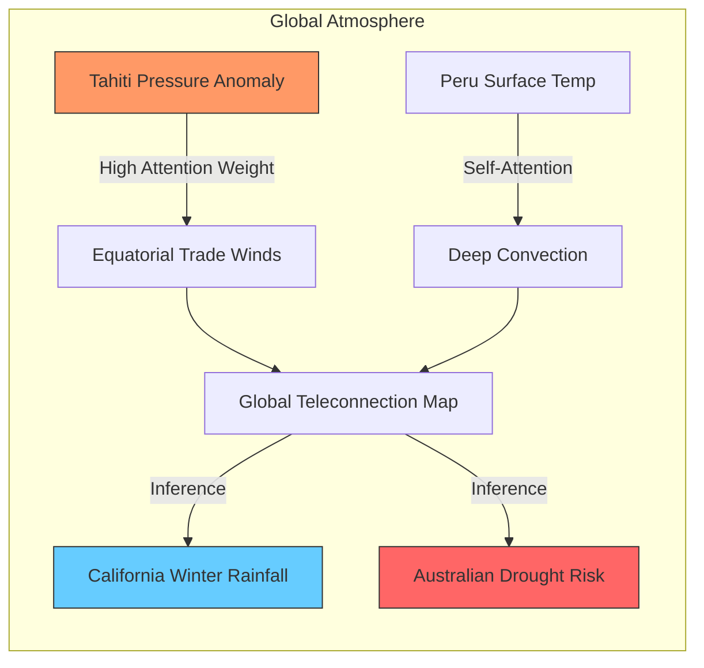

# Chapter 6: The Transformer Revolution and Earth Foundation Models

The evolution of **Artificial Intelligence** in the atmospheric sciences has reached a pivotal juncture with the advent of the **Transformer** architecture. Historically, convolutional neural networks (CNNs) dominated the field because of their ability to process the structured, grid-based data common in **Numerical Weather Prediction (NWP)** models. However, the atmosphere is not a collection of independent pixels; it is a global system of interconnected phenomena where local changes can have distant consequences. The Transformer, with its core mechanism of **Self-Attention**, offers a radical departure from local filters by allowing every point in the atmosphere to "talk" to every other point, regardless of physical distance. This chapter explores how this shift from local convolutions to global attention is redefining our ability to model the Earth system at scale.

## 6.1 The Attention Mechanism: Moving Beyond Fixed Grids

The fundamental limitation of CNNs lies in their **inductive bias** of locality. A convolutional filter only sees a small neighborhood of grid cells at once, requiring many layers to build a global field of view. In contrast, the **Attention Mechanism** allows a model to dynamically weigh the importance of different parts of the input data. This is particularly relevant for the Earth system, where a storm in the Atlantic may be influenced by a pressure anomaly in the Sahara. By calculating a weighted sum of all input features, the Transformer can focus its "attention" on the most relevant physical drivers, effectively moving beyond the constraints of a fixed spatial grid.

### 6.1.1 The Mathematics of Queries, Keys, and Values
The engine of the Transformer is the **Scaled Dot-Product Attention**. To compute this, the model transforms the input representation into three distinct vectors: the **Query** ($Q$), the **Key** ($K$), and the **Value** ($V$). Each vector is produced by multiplying the input embedding $X$ by learned weight matrices $W^Q$, $W^K$, and $W^V$. The Query represents the feature we are currently looking for, the Key represents the features available in the dataset, and the Value represents the actual information to be extracted. The relationship between these vectors is expressed as:

$$\text{Attention}(Q, K, V) = \text{softmax}\left(\frac{QK^T}{\sqrt{d_k}}\right)V \quad (\text{Eq. 6.1})$$

In this expression, $d_k$ is the dimension of the keys, used as a scaling factor to prevent the gradients of the **softmax** function from vanishing. The term $QK^T$ represents the compatibility or "similarity" between every pair of points in the input sequence. The result of the softmax operation is a set of weights that determine how much information from each Value vector should be contributed to the final output for a given Query.

### 6.1.2 Global Connectivity and Computational Complexity
Because the attention mechanism computes interactions between all pairs of inputs, its computational complexity is $O(n^2)$, where $n$ is the number of tokens. In a global weather model, $n$ can be extremely large, especially when dealing with high-resolution grids. To manage this, researchers often use **Multi-Head Attention (MHA)**, which allows the model to jointly attend to information from different representation subspaces at different positions. This is analogous to having multiple "experts" looking at the same map: one might focus on moisture transport, while another focuses on vorticity.

$$\text{MultiHead}(Q, K, V) = \text{Concat}(\text{head}_1, ..., \text{head}_h)W^O \quad (\text{Eq. 6.2})$$

Each $\text{head}_i$ is an independent attention operation, and $W^O$ is a final output projection matrix. This structure enables the model to capture complex, multi-scale dependencies that are often missed by traditional localized kernels. For the atmospheric scientist, this means the model can simultaneously learn micro-scale turbulence and planetary-scale waves, provided that the training data and computational resources are sufficient.

## 6.2 Tokens of the Atmosphere: Tokenization Strategies

To apply Transformers to the Earth system, we must first answer a fundamental question: what constitutes a **token** in weather and climate science? In Natural Language Processing, tokens are words or sub-words. In the Earth system, we deal with continuous fields of temperature, pressure, and humidity. The process of **Tokenization** involves discretizing these continuous fields into discrete units that the Transformer can process as a sequence. The choice of tokenization strategy directly impacts the model's ability to learn physical hierarchies and handle the vast dimensionality of Earth data.

### 6.2.1 Patching Spatial Grids: The Vision Transformer Approach
One common strategy, inherited from the **Vision Transformer (ViT)**, is to divide a global grid into small, non-overlapping **patches**. For example, a $0.25^\circ$ resolution global map of temperature might be divided into $16 \times 16$ pixel patches. Each patch is then flattened and projected into a high-dimensional embedding space. This approach treats each patch as a single token, representing a localized "climate regime." While efficient, this method introduces an artificial boundary between patches, which can be mitigated through the use of **Positional Encodings** to inform the model of each token's geographic location.

### 6.2.2 Individual Stations and Points as Tokens
Alternatively, we can treat individual weather stations or measurement points as tokens. This is particularly useful for **sparse data** or irregular networks. In this framework, the Transformer does not require a regular grid; instead, it treats the collection of stations as a **set**. Each token consists of the station's observations (e.g., wind speed, pressure) concatenated with its coordinates (latitude, longitude, elevation). This flexibility allows the model to ingest data directly from the **Global Telecommunication System (GTS)** without the need for an intermediate **objective analysis** or gridding step.

### 6.2.3 Feature-wise vs. Spatial Tokenization
Advanced models often combine spatial and feature-wise tokenization. In **Feature-wise Tokenization**, different variables (e.g., $T850$, $U200$, $Q500$) are treated as distinct tokens for the same geographic location. This allows the attention mechanism to learn the vertical and physical correlations between variables directly. For instance, the model can learn that a rise in vertical velocity ($W$) is strongly associated with a decrease in pressure ($P$) and an increase in cloud cover, effectively "attending" to the laws of fluid dynamics without them being explicitly programmed.

## 6.3 Handling Irregular Data: The Advantage Over CNNs

A persistent challenge in Earth science is the irregularity of raw data. While reanalysis products like **ERA5** provide a neat, gridded view of the past, real-time observations come from a chaotic mix of sources: polar-orbiting satellites, geostationary sensors, weather balloons, and aircraft. CNNs struggle with this data because they require a structured grid. If a satellite swath is missing pixels or has a "curved" geometry, the data must be interpolated, a process that introduces errors and loses fine-scale information.

### 6.3.1 Satellite Swath Processing and Permutation Invariance
Transformers are inherently **permutation invariant**, meaning they treat the input as a set of items rather than a fixed sequence. This property makes them ideally suited for raw satellite data. A satellite "swath" is essentially a collection of points in space-time. By treating each observation point as a token, a Transformer can process the swath in its native geometry. The model uses the spatial coordinates of each point to calculate attention, ensuring that the physical proximity of observations is respected without forcing them onto a rigid grid.

### 6.3.2 Masking and Data Assimilation
The ability to handle missing data is a hallmark of the Transformer. Through **Masked Autoencoding**, a model can be trained to predict missing or "masked" parts of the atmosphere based on the surrounding context. In the context of **Data Assimilation (DA)**, this is revolutionary. Traditional DA uses complex optimization (like 4D-Var) to fill gaps in observations. A Transformer-based foundation model can perform a similar task by attending to all available observations across different times and locations to "inpaint" the missing state of the atmosphere, often with much lower computational latency.

### 6.3.3 Multi-modal Integration
Earth observations are multi-modal by nature. We have infrared radiance from satellites, radar reflectivity from ground stations, and point-source data from buoys. Because Transformers map all inputs into a common embedding space, they can easily integrate these disparate data types. A single model can "attend" to a specific satellite channel to detect cloud top temperatures while simultaneously "attending" to a nearby buoy to confirm surface pressure. This holistic view is difficult to achieve with CNNs, which would require separate, specialized architectures for each data format.

## 6.4 Self-Attention and Teleconnections: A Physical Analogy

One of the most profound features of the Transformer is its ability to learn **Teleconnections**. In climate science, a teleconnection refers to a significant correlation between weather patterns in widely separated regions of the globe. The most famous example is the **El Niño-Southern Oscillation (ENSO)**, where changes in the sea surface temperature of the central Pacific lead to predictable weather shifts in North America, Peru, and Australia. Traditional local models often fail to capture these long-range dependencies, but for a Transformer, the distance between the Pacific and Peru is no different from the distance between two adjacent grid cells.

### 6.4.1 Learning the ENSO Connection
Consider the relationship between pressure in Tahiti and Darwin, Australia. These two locations are the basis for the **Southern Oscillation Index (SOI)**. A Transformer trained on global reanalysis data can learn to attend to the pressure state in Tahiti when predicting the rainfall in Australia. Through the $QKV$ mechanism, the Query (Australian rainfall) "seeks" information from the Key (Tahiti pressure). If the learned weights indicate a strong physical link, the Value (the specific pressure anomaly) is heavily weighted in the model's prediction.

*Figure 6.1: The Attention mechanism mapping global teleconnections. Unlike local filters, the Transformer builds a dynamic graph of dependencies, allowing a pressure drop in one region to directly inform a prediction thousands of kilometers away.*

### 6.4.2 Rossby Waves and Planetary Scale Interactions
The Transformer's ability to capture long-range dependencies is also critical for modeling **Rossby Waves**. These are giant meanders in the high-altitude winds that have a major impact on weather. A Rossby wave can span an entire hemisphere, and its movement is governed by the conservation of potential vorticity across the globe. By attending to the entire atmospheric field at once, the Transformer can maintain the coherence of these waves over time, preventing the "drift" or dissipation often seen in models that rely on local approximations.

### 6.4.3 Explaining Model Decisions through Attention Maps
A significant advantage of the Transformer is its **interpretability**. By visualizing the attention maps (the weights from Eq. 6.1), researchers can see exactly which parts of the globe the model is prioritizing for a specific forecast. If the model predicts a heatwave in Europe, we can check the attention map to see if it was looking at an atmospheric block over the North Atlantic or a specific moisture plume from the tropics. This allows scientists to verify that the AI is learning real physical relationships rather than spurious correlations in the data.

## 6.5 Earth System Foundation Models (ESFMs)

The culmination of the Transformer revolution is the creation of **Earth System Foundation Models (ESFMs)**. A foundation model is a massive neural network trained on a vast, diverse dataset that can be adapted to a wide range of downstream tasks. In Earth science, this means pre-training a model on petabytes of historical data, including **ERA5**, satellite archives, and even high-resolution simulations. Once pre-trained, this model "understands" the general dynamics of the Earth system and can be fine-tuned for specific, high-value applications with relatively little additional data.

### 6.5.1 Pre-training on the Global Archive
The scale of data used for ESFMs is unprecedented. Models like **FourCastNet**, **Pangu-Weather**, and **GraphCast** have been trained on decades of 3D atmospheric states. The pre-training objective is typically to predict the state of the atmosphere at the next time step (e.g., 6 hours ahead). During this process, the model learns the "grammar" of the atmosphere: the way fronts move, the way radiation interacts with clouds, and the way the land surface influences the air above it. This knowledge is stored in billions of parameters, forming a digital twin of the Earth's physical laws.

### 6.5.2 Downstream Tasks and Fine-tuning
After pre-training, the ESFM acts as a powerful feature extractor. To predict a specific event, such as **flood forecasting** in a specific river basin or **wind-power production** at a specific farm, the model undergoes **Fine-tuning**. During fine-tuning, the weights of the foundation model are slightly adjusted using a smaller, task-specific dataset. Because the model already understands the large-scale atmospheric context, it can achieve high accuracy on these local tasks far more quickly than a model trained from scratch.

### 6.5.3 The Future: Multi-component Foundation Models
Current ESFMs primarily focus on the atmosphere, but the future lies in **Coupled Foundation Models**. These models will integrate the atmosphere, the ocean, the cryosphere, and the biosphere into a single Transformer architecture. By tokenizing ocean currents, sea-ice extent, and vegetation indices alongside atmospheric variables, the model can learn the complex feedbacks that drive long-term climate change. This represents the ultimate goal of AI in Earth science: a unified, data-driven model that can simulate the entire Earth system with the speed of a neural network and the physical consistency of a traditional climate model.

## 6.6 Summary & Bibliography

The transition to Transformer architectures represents a paradigm shift in how we process and understand Earth data. By moving from fixed grids to flexible attention mechanisms, we have unlocked the ability to process irregular observations, capture global teleconnections, and build massive foundation models. These models are not just faster versions of traditional NWP; they are fundamentally different tools that can learn the complex, non-linear dependencies of our planet directly from data. As we scale these models to include more components of the Earth system, they will become indispensable for predicting weather, managing resources, and understanding our changing climate.

### Bibliography for Chapter 6

*   **Bi, K., Xie, L., Zhang, H., Chen, X., Gu, X., and Tian, Q. (2023).** *Accurate medium-range global weather forecasting with 3D neural networks*. Nature.
*   **Dosovitskiy, A., et al. (2020).** *An Image is Worth 16x16 Words: Transformers for Image Recognition at Scale*. arXiv preprint arXiv:2010.11929.
*   **Lam, R., et al. (2023).** *Learning skillful medium-range global weather forecasting*. Science.
*   **Nguyen, T., et al. (2023).** *ClimaX: A foundation model for weather and climate*. ICML.
*   **Pathak, J., et al. (2022).** *FourCastNet: A Global Data-driven High-resolution Weather Forecasting Model using Adaptive Fourier Neural Operators*. arXiv preprint arXiv:2202.11214.
*   **Vaswani, A., et al. (2017).** *Attention is All You Need*. Advances in Neural Information Processing Systems.
